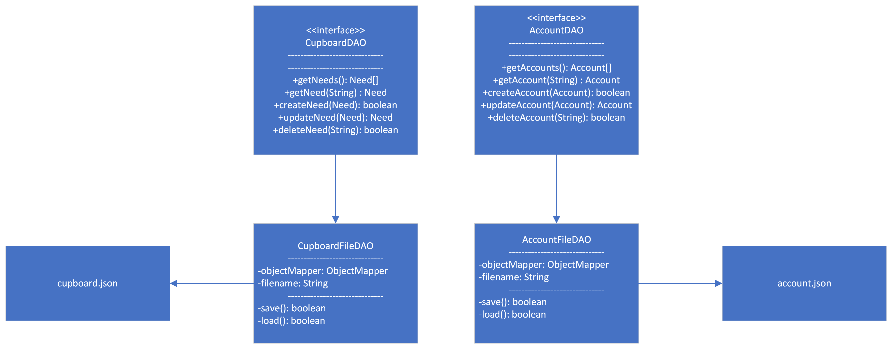

# PROJECT Design Documentation

> _The following template provides the headings for your Design
> Documentation.  As you edit each section make sure you remove these
> commentary 'blockquotes'; the lines that start with a > character
> and appear in the generated PDF in italics but do so only **after** all team members agree that the requirements for that section and current Sprint have been met. **Do not** delete future Sprint expectations._

## Team Information
* Team name: The Right Angle
* Team members
  * Logan Nickerson
  * Leah Delnesa
  * May Jiang
  * Kieran Stewart
  * Douglas Tavolette

## Executive Summary

This is a summary of the project.

### Purpose
>  _**[Sprint 4]** Provide a very brief statement about the project and the most
> important user group and user goals._

This is a website for the Hope Center that aims to help the church keep track of donation and volunteering hours. Admins on the site will be able to manage all the needs that church currently have avaliable that users can contribute to. Some needs will ask for monetary donation while other will ask for volunteer hours. 
### Glossary and Acronyms
> _**[Sprint 4]** Provide a table of terms and acronyms._

| Term | Definition |
|------|------------|
| SPA | Single Page |

## Requirements

This section describes the features of the application.

> _In this section you do not need to be exhaustive and list every
> story.  Focus on top-level features from the Vision document and
> maybe Epics and critical Stories._
* Account management (create,delete,update,and login accounts)
* Need management (create,delete,and update needs)
* Funding Basket management (add,remove,and save needs within the funding basket)

### Definition of MVP
> _**[Sprint 4]** Provide a simple description of the Minimum Viable Product._

Admins and users will log into the website portal, where they will be directed to their personal dashboard. Admins on the site will be able to add/delete/update needs to the cupboard, and users will be able to send donation and/or sign up for vounteering hours for needs in their funding basket taken from the cupboard. Users will be able to add the needs to their basket by reviewing the list of avaliable needs the admins has created. Once the user is satisfied with their contribution, they can check out their funding basket which will update the information in the backend for the admin and future users to see. 

### MVP Features
>  _**[Sprint 4]** Provide a list of top-level Epics and/or Stories of the MVP._

### Enhancements
> _**[Sprint 4]** Describe what enhancements you have implemented for the project._

## Application Domain

This section describes the application domain.

> _**[Sprint 4]** Provide a high-level overview of the domain for this application. You
> can discuss the more important domain entities and their relationship
> to each other._
> There is a cupboard that contains needs. Each needs has it's own property that the manager/admin and edit. The only need property that normal user/helpers can change is progression and volunteer hours, but they can only change these values after they add needs from the cupboard to their funding basket. Changes they make to need will be checkout for it to change any information in the cupboard. Manager and helpers are disguinshed based on their login account. 

## Architecture and Design

This section describes the application architecture.

### Summary

The following Tiers/Layers model shows a high-level view of the webapp's architecture. 

The web application, is built using the Model–View–ViewModel (MVVM) architecture pattern. 

The Model stores the application data objects including any functionality to provide persistance. 

The View is the client-side SPA built with Angular utilizing HTML, CSS and TypeScript. The ViewModel provides RESTful APIs to the client (View) as well as any logic required to manipulate the data objects from the Model.

Both the ViewModel and Model are built using Java and Spring Framework. Details of the components within these tiers are supplied below.

### Overview of User Interface

The user interface is built with Angular 15.

This section describes the web interface flow; this is how the user views and interacts with the web application.

> _Provide a summary of the application's user interface.  Describe, from the user's perspective, the flow of the pages in the web application._

### View Tier
> _**[Sprint 4]** Provide a summary of the View Tier UI of your architecture.
> Describe the types of components in the tier and describe their
> responsibilities.  This should be a narrative description, i.e. it has
> a flow or "story line" that the reader can follow._

> _**[Sprint 4]** You must  provide at least **2 sequence diagrams** as is relevant to a particular aspects 
> of the design that you are describing.  (**For example**, in a shopping experience application you might create a 
> sequence diagram of a customer searching for an item and adding to their cart.)
> As these can span multiple tiers, be sure to include an relevant HTTP requests from the client-side to the server-side 
> to help illustrate the end-to-end flow._

> _**[Sprint 4]** To adequately show your system, you will need to present the **class diagrams** where relevant in your design. Some additional tips:_
 >* _Class diagrams only apply to the **ViewModel** and **Model** Tier_
>* _A single class diagram of the entire system will not be effective. You may start with one, but will be need to break it down into smaller sections to account for requirements of each of the Tier static models below._
 >* _Correct labeling of relationships with proper notation for the relationship type, multiplicities, and navigation information will be important._
 >* _Include other details such as attributes and method signatures that you think are needed to support the level of detail in your discussion._

### ViewModel Tier
* CupboardController: This is the controller class that handles all the HTTP request that handles the Needs object. It's uses the REST API and Spring to handle all the HTTP requests.
* Need: This is an object that holds all the properties of a need. Those properties are: goal, progress, name, description, volunteer dates, deadline, type.
* Date: This is an object that hold the year, month, and date information. It is used by the Need class to define the date of which volunteers are needed.
* NeedType: This is an enum to help seperate the monetary needs from the volunteer needs.
* AccountController: This is the controller class that  handles all the HTTP request that handles the Account object. It's uses the REST API and Spring to handle all the HTTP requests.
* Account: This is an object that holds all the properties of an account. These properties are: name, password, email, isAdmin.

> _**[Sprint 4]** Provide a summary of this tier of your architecture. This
> section will follow the same instructions that are given for the View
> Tier above._

> _At appropriate places as part of this narrative provide **one** or more updated and **properly labeled**
> static models (UML class diagrams) with some details such as critical attributes and methods._
> 

### Model Tier
> _**[Sprint 3 & 4]** Provide a summary of this tier of your architecture. This
> section will follow the same instructions that are given for the View
> Tier above._
* CupboardDAO: This is an interface that that defines methods needed to alter data in the cupboard.json. This is also our seam for unit testing.
* CupboardFileDAO: This is a class that implements CupboardDAO and defines all the methods. This is the class that actually make the changes to the cupboard.json.
* Cupboard.json: This is the database that hold all the Needs objects in the cupboard.
* AccountDAO: This is an interface that that defines methods needed to alter data in the account.json. This is also our seam for unit testing.
* AccountFileDAO: This is a class that implements AccountDAO and defines all the methods. This is the class that actually make the changes to the account.json.
* Account.json: This is the database that hold all the account objects.
> _At appropriate places as part of this narrative provide **one** or more updated and **properly labeled**
> static models (UML class diagrams) with some details such as critical attributes and methods._
> 

## OO Design Principles

* Dependency injection: We are using Spring framework which creates a CupboardFileDAO object. The controller class receives an instance of the interface CupboardDAO that has methods needed to alter data in the cupboard.json. When we have to write data to the cupboard.json we used CupboardFileDAO which implements the methods from the interface CupboardDAO. CupboardController does not depend on the specific implementation, however, as long as it implements CupboardDAO. The CupboardDAO, as an interface, enforces CupboardFileDAO to contain the correct methods. If we need to change how data is written to cupboard.json (or if we get rid of cupboard.json altogether) we can do so without impacting the functionality of the CupboardController.
* Single Responsibility: For our UI, we use multiple angular services to help direct the flow of different data between the different components. For example, we have both a NeedService, BasketService, and LoginService. NeedService is specifically used to send the HTTP request to the CupboardController to manipulate data in the cupboard.json. The BasketService allows users to add, remove, update, and clear needs from their funding basket. When a user wants to checkout their funding basket, NeedService is called to send the HTTP request to the CupboardController to make changes to the cupboard.json while the BasketService is called to clear the funding basket. LoginService handles all the HTTP request to the AccountController to manipulate data in the account.json, and to also verify that usernames and passwords match each other when users login.  Need component (the way we show a need), for example, can use the Need service without caring about how Needs are retreived.  Need service, therefore, has that single responsibility.

> _**[Sprint 3 & 4]** Will eventually address upto **4 key OO Principles** in your final design. Follow guidance in augmenting those completed in previous Sprints as indicated to you by instructor. Be sure to include any diagrams (or clearly refer to ones elsewhere in your Tier sections above) to support your claims._

> _**[Sprint 3 & 4]** OO Design Principles should span across **all tiers.**_

## Static Code Analysis/Future Design Improvements
> _**[Sprint 4]** With the results from the Static Code Analysis exercise, 
> **Identify 3-4** areas within your code that have been flagged by the Static Code 
> Analysis Tool (SonarQube) and provide your analysis and recommendations.  
> Include any relevant screenshot(s) with each area._

> _**[Sprint 4]** Discuss **future** refactoring and other design improvements your team would explore if the team had additional time._

## Testing
> _This section will provide information about the testing performed
> and the results of the testing._

### Acceptance Testing
> _**[Sprint 4]** Report on the number of user stories that have passed all their
> acceptance criteria tests, the number that have some acceptance
> criteria tests failing, and the number of user stories that
> have not had any testing yet. Highlight the issues found during
> acceptance testing and if there are any concerns._

All completed stories pass their acceptance testing, but some UI stories have other issues. A recent release has fixed outstanding log in issues, but a remaining quirk is that when logging in with a username that does not exist, a console error is generated.  This does not impact the functionality of log in.  Admin privileges are successfully loaded, but they do not impact the site yet.

### Unit Testing and Code Coverage
> _**[Sprint 4]** Discuss your unit testing strategy. Report on the code coverage
> achieved from unit testing of the code base. Discuss the team's
> coverage targets, why you selected those values, and how well your
> code coverage met your targets._

>_**[Sprint 4]** **Include images of your code coverage report.** If there are any anomalies, discuss
> those._

## Ongoing Rationale
>_**[Sprint 1, 2, 3 & 4]** Throughout the project, provide a time stamp **(yyyy/mm/dd): Sprint # and description** of any _**mayor**_ team decisions or design milestones/changes and corresponding justification._
