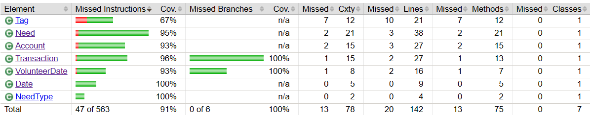

# PROJECT Design Documentation

## Team Information
* Team name: The Right Angle
* Team members
  * Logan Nickerson
  * Leah Delnesa 
  * May Jiang
  * Kieran Stewart
  * Douglas Tavolette

## Executive Summary

This is a summary of the project.

### Purpose
This is a website for the Hope Center that aims to help the church keep track of donation and volunteering hours. Admins on the site will be able to manage all the needs that the Hope Center currently has available that users can contribute to. Some needs will ask for monetary donation while others will ask for volunteer hours. The most important user group in this application is the potential volunteers, whose goals are to donate either their time or money through a simple and effective site. 

### Glossary and Acronyms

| Term | Definition |
|------|------------|
| Manager | Account of admin in U-fund |
| Helper/Volunteer | Account of general user |
| Tags | System used to filter needs and volunteers |
| need-details | Class containing all details represented in a single need |

## Requirements

This section describes the features of the application.

* Account management (create, delete, update, and login accounts)
* Need management (create, delete, and update needs)
* Funding Basket management (add, remove, checkout, and maintain needs within the funding basket)

### Definition of MVP

Admins and users will log into the website portal, where they will be directed to their personal dashboard. Admins on the site will be able to add/delete/update needs to the cupboard, and users will be able to send donations and/or sign up for volunteering hours for needs in their funding basket taken from the cupboard. Users will be able to add the needs to their basket by reviewing the list of available needs the admins has created. Once the user is satisfied with their contribution, they can check out their funding basket which will update the information in the backend for the admin and future users to see. 

### MVP Features
  Authentication/Login in: 
1) Users have the ability to log in and out of application
2) U-fund Manager logs in using reserved username of "admin" - any other username is assumed to be helpers/volunteers. 
3) Usernames also can't be duplicated

  Volunteer Functionality 
1) A Volunteer is able to see Cupboard containing list of needs
2) A Volunteer is able to search through needs
3) A Volunteer is able to add and remove needs from their funding basket
4) A Volunteer is able to "checkout" (commit to purchase/volunteering) to need(s) in their funding basket - Cupboard and corresponding needs are updated accordingly 

  U-fund Manager Functionality
1) U-fund Manager is able to add, remove, and edit need(s) within Cupboard
2) U-fund Manager is able to search through needs
3) U-fund Manager does NOT have access to funding basket and in turn checkout, but is able to view transaction history of a need
4) U-fund Manager is able to create tags and delegate to specific needs and volunteers 

### Enhancements

The first enhancement incorporated is time stamps along with donor payments. When viewing a need, an admin user is able to look and see a table with the history of every transaction made on that need including the date and monetary amount donated. 

Our second enhancement is Authorized Volunteers. Admins have the ability to create tags. These tags are then delegated to needs and certain volunteers. Volunteers are then able to view needs that contain the corresponding tags they’ve been given by the admin. For example, say an admin creates a need called “School fund”, and say they only want certain volunteers to be able to see and donate to this need. They can create a tag called “School exclusive” and attach it to the “School fund” need. Then they can go the volunteer accounts and attach the tag to whatever volunteers they choose to. These volunteers are thus given exclusive access to said need.

## Application Domain

This section describes the application domain.

Entities + Relationships:

Manager- represents a U-Fund manager account
  1) Manager->Cupboard: able to add, remove, edit needs within Cupboard
  2) Manager->Helper: manage permissons/view of volunteers
  3) Manager->Needs: able to view monetary transaction history of each need

Helper- represents a Volunteer account
  1) Helper->Checkout: able to confirm and commit to need(s)
  2) Helper->Funding Basket: able to add need(s) they want to support to basket
  3) Helper->Needs: able to view needs of U-Fund 

Needs- represents a goal of the U-fund - from volunteer view simply contains monetary/volunteer goal, deadline. Manager contains same view in addition to transaction history
  1) Needs->Helper: 

Cupboard- contains list of needs

Funding Basket- represents container where needs volunteer choose to support are collected

Checkout- represents space where volunteers confirm to chosen needs 
  1) Checkout->Needs: updates progress on needs checked out by helper/volunteer
  2) Checkout->Cupboard: updates quantity of needs seen by helper depending on whether a donation has fully fulfilled a need 
  3) Checkout->Funding Basket: looks at Funding Basket for needs that need to be updated

## Architecture and Design

This section describes the application architecture.

### Summary

The following Tiers/Layers model shows a high-level view of the webapp's architecture. 

The web application, is built using the Model–View–ViewModel (MVVM) architecture pattern. 

The Model stores the application data objects including any functionality to provide persistence. 

The View is the client-side SPA built with Angular utilizing HTML, CSS and TypeScript. The ViewModel provides RESTful APIs to the client (View) as well as any logic required to manipulate the data objects from the Model.

Both the ViewModel and Model are built using Java and Spring Framework. Details of the components within these tiers are supplied below.

### Overview of User Interface

The user interface is built with Angular 15.

This section describes the web interface flow; this is how the user views and interacts with the web application.

User Interface HTML layout

When the application is initally opened, a user is brought to the login screen where they can input their login information if they have a preexisting account. If the user needs to create an account they can click the button "Create An Account" which will lead them to a serparate page that inquires for a new username, password, and email. Once an account is created the user gets a confirmation message and brought back to the original login screen.

For a user that is just a volunteer, they are brought to a Homepage that contains a header with directories to logging out, the current Homepage, and Checkout. Below the header lies the Cupboard with the list of needs, and below that there a section labeled "Detail section". When a user clicks a need this view will change to display the details of that specific need. Below that there's a Search bar for the Cupboard, and below that is the Users funding basket. When adding and removing needs from a users funding basket the user remains on the same page. When clicking the Checkout they are brought to a separate page which displays they're current basket and prompts for confirmation. When confirmed user is brought to a page that relays the succes of payments and prompts them to direct a different page. 

For a user that is an admin they're also brought to a Homepage. The header contains directories Logout, the current Homepage, Create Tags, and Configure Account Tags. From top to bottem the Homepage contains the Cupboard, a Detail, Edit, and Create Needs section, and a Search needs bar. Same as removing and adding needs, when an admin is editing and creating they remain on the homepage. The Create Tags directory brings admins to a page inquiring details on the newly desired tag, and when the button "Create Tag" is hit the admin is brought back to Homepage. The Configure Account Tags brings admin to a page containing all current user accounts. When delegating tags to certain user the admin remains on the same page, with the display altering to display the current tags a user contians and all the available tags there are. Admin can then return to Homepage by using the Header.

### View Tier

Sequence Diagram of a customer searching for an item and adding to their cart.

Sequence diagram of a admin adding creating tag and creating filter by attaching it to a need and a user

The Entierty of our UI Lies in App. Within the App there are 2 main components, the Header (being the RouterLink), and the home-view. The home-view from top to bottom is made up of the Cupboard, Search bar, and funding-basket. The Search bar and the funding-basket both contain a list of need-buttons that when clicked open up to the need-detail, which lies in the Cupboard along with the entire collection of need-buttons.

need-detail contains a hefty amount. On the left hand side going from top to bottom it contains the description containing info on the current need displaying (shown as static text) it's followed by a list of tags, the add/remove from funding basket buttons, the dates if the need is one that requires volunteers time, and finally a display of the transaction history for said need. On the right hand of the Cupboard lies need-edit, where there are a list of optional entries that can be used to update need. Below that collection of information Create new need entry, where only a name is required to be input for that need-button to be added in the collection at the top of the Cupboard

### ViewModel Tier
* CupboardController: This is the controller class that handles all the HTTP request that handles the Needs object. It's uses the REST API and Spring to handle all the HTTP requests.
* Need: This is an object that holds all the properties of a need. Those properties are: goal, progress, name, description, volunteer dates, deadline, type.
* Date: This is an object that hold the year, month, and date information. It is used by the Need class to define the date of which volunteers are needed.
* NeedType: This is an enum to help separate the monetary needs from the volunteer needs.
* AccountController: This is the controller class that  handles all the HTTP request that handles the Account object. It's uses the REST API and Spring to handle all the HTTP requests.
* Account: This is an object that holds all the properties of an account. These properties are: name, password, email, isAdmin.

### Model Tier

* CupboardDAO: This is an interface that that defines methods needed to alter data in the cupboard.json. This is also our seam for unit testing.
* CupboardFileDAO: This is a class that implements CupboardDAO and defines all the methods. This is the class that actually make the changes to the cupboard.json.
* Cupboard.json: This is the database that hold all the Needs objects in the cupboard.
* AccountDAO: This is an interface that that defines methods needed to alter data in the account.json. This is also our seam for unit testing.
* AccountFileDAO: This is a class that implements AccountDAO and defines all the methods. This is the class that actually make the changes to the account.json.
* Account.json: This is the database that hold all the account objects.

## OO Design Principles

* Dependency injection: We are using Spring framework which creates a CupboardFileDAO object. The controller class receives an instance of the interface CupboardDAO that has methods needed to alter data in the cupboard.json. When we have to write data to the cupboard.json we used CupboardFileDAO which implements the methods from the interface CupboardDAO. CupboardController does not depend on the specific implementation, however, as long as it implements CupboardDAO. The CupboardDAO, as an interface, enforces CupboardFileDAO to contain the correct methods. If we need to change how data is written to cupboard.json (or if we get rid of cupboard.json altogether) we can do so without impacting the functionality of the CupboardController.
* Single Responsibility: For our UI, we use multiple angular services to help direct the flow of different data between the different components. For example, we have both a NeedService, BasketService, and LoginService. NeedService is specifically used to send the HTTP request to the CupboardController to manipulate data in the cupboard.json. The BasketService allows users to add, remove, update, and clear needs from their funding basket. When a user wants to checkout their funding basket, NeedService is called to send the HTTP request to the CupboardController to make changes to the cupboard.json while the BasketService is called to clear the funding basket. LoginService handles all the HTTP request to the AccountController to manipulate data in the account.json, and to also verify that usernames and passwords match each other when users login.  Need component (the way we show a need), for example, can use the Need service without caring about how Needs are retrieved.  Need service, therefore, has that single responsibility.
* Pure Fabrication: For our application's UI, the Need class was responsible for managing all aspects related to user needs, including details and editing functionalities. But as we starting implementing tools the managers would be using and the application grew more complex, it became apparent that it was too much for a single class to hold responsibility of. This resulted in us creating the need-detail class and the need-edit. Now instead of offloading functionaility into the need class itself, need-detail and need-edit are able to bear a majority of the load 
* Low Coupling: When creating classes we ensured information for a class was contained in and of itself. Classes intearct with one another but if altered independently the relating classes would function as normal. For example, our overarching Need class and Account class both interact with our Tag class- admins are able to add tags onto a user account and onto needs. This is done by Need and Account calling tag functionality through tag-manager.service. By ensuring that each class encapsulates its own data and functionality, we minimize dependencies between classes, allowing them to evolve and be changed independently without affecting the behavior of other components.

## Static Code Analysis/Future Design Improvements
* Area 1: logger string concatenation
We passed strings to the logger in Java with string concatenation, like "Name: " + name.  This apparently adds overhead to concatenate the string, which is unnecessary.  We should instead use the logger's built in formatting, similar to the printf() method. There are a lot of instances of this issue flagged in Sonar.  Our recommended fix is to go through each logging instance and use the built in formatting.  If that isn't possible in the future for some reason, consider using the lazy load, which takes the form of ()->expression.  This also applies to the front end, where we log to the console.

* Area 2: less than elegant code
There were several areas of code that were flagged as "clumsy."  The screenshot below shows an instance where a boolean literal was used instead of the !.  Another similar issue is an if statement that was used when the boolean condition should have been returned.  if(expression) return true; return false; should be rewritten as return expression;.  Other errors were similar to this, and can all be categorized as awkward boolean handling.  The reason they are errors is because they create confusion and make code less readable.  Elegance improves comprehension and maintainability. Further examples of boolean fumbles take the following forms: !(a == b) --> a != b, method() == false --> !method(), and if(condition) return false; else return true; -->  return condition;.  Our recommended fix is to replace these instances with their alternatives as suggested by Sonar and elegant boolean logic.

* Area 3: style
There are a few instances of incorrect style, which negatively impacts readability.  It can also cause psychological damage to Java programmers.  One instance is the order of modifiers, which should be private static final, as seen in the image below.  This is a problem because it doesn't sound right, and maybe causes less readability.  Another style error is naming variables with a CapitalLetter at the start, but they should use camelCase.  This example causes confusion between the Need class and the need instance, which was called Need.  Capital camel case is reserved for classes in Java.  Our recommended fix is to replace these style errors with their respective solutions, and use caution with the ctrl+F feature of their favorite IDE.  New developers should make sure their IDE has a reasonably distinct color for variables and class names at least until all occurrences of this issue are resolved.

* Area 4: ArrayList implementation exposed
This screenshot shows that we returned an ArrayList in a getter.  Sonar says we should return just a List for better single responsibility.  We would take it a step further and say that this class should not return any kind of List.  An array would be better, and we acknowledge that the ArrayList solution is a last minute hack.  We did this because the json serialization was acting up.  We have since implemented a solution to the json problems, and we encourage new developers to allocate proper time and team attention to areas of code that use external imports such as Jackson.  The reason we should not return a specific implementation of List is because it exposes the inner workings of the class too much.  We also use more getters and setters than are strictly necessary.  Our backend does relatively little manipulation to the data; these excess methods are really just there because the Spring tutorial we followed had so many (which were there in turn to just take up space).  Getters and setters should exist as a way of manipulating their object in a way that makes intuitive sense to someone who knows nothing about the class' implementation, so having getters and setters for everything makes our classes harder to use.  This last intuition is not reported by Sonar because it has no way of detecting this.  Our recommended fix is to replace the ArrayList with an Array, at least superficially.  We also suggest trimming the getters and setters down to what is strictly necessary, and favor descriptive methods over manipulating method results.  New developers should not under any circumstances iterate over an array returned by a method, and should avoid returning anything that isn't suggested by the method's name.

* Area 5: use let instead of var
In JavaScript and TypeScript, var and let are two ways to create a variable.  The difference between the two has nothing to do with their three letter names.  Using var creates a variable that can be hoisted, meaning that it can be used out of scope.  Using let fixes this, and the variable declared will be in the block scope.  This is a problem because it ruins abstraction by exposing this highly internal variable to the entire program.  Our recommended fix is to immediately replace all instance of var with let or const, depending on whether or not the variable changes.

If we were given more time to work on our application we think there are many changes that could made to the user interface regarding style and functionality when it comes to the look of the cupboard. At a certain point because of the way we presented our needs after adding a certain amount of needs they run off the page. If we had more time we could possibly create icons instead of tabs side to side, and resize the cupboard when too much space has been taken up. As for the matter of refactoring, we most likley would alter the current state of our UI applcation, because although it works seamlessly, a majority of it lies within a single class's (need-details) html. We should most likley choose home-view as the class to designate this responsibility to instead

## Testing
Here are a few of the ways we tested our application.

### Acceptance Testing

All completed stories pass their acceptance testing accept for checking out in the case of a need with a volunteer, but some UI stories have other issues. A recent release has fixed outstanding log in issues, but a remaining quirk is that when logging in with a username that does not exist, a console error is generated.  This does not impact the functionality of log in.  Admin privileges are successfully loaded, but they do not impact the site yet. There are a couple more console errors, for example when admin goes onto a need that's goal is volunteer hours, transaction history returns back a 404.

### Unit Testing and Code Coverage

We went about our unit testing by creating at least one test for each function ensuring the success of it. For some functions such as the ones found in CupboardController a tests was created to see a functions's success, failure, handle exception, and not found. There was an uncertainity over how easily it would be to utilize mockito at the end of sprint 2 but it's implementation proved to be pretty seamless.

For a code coverage target we aimed for above a 90-95%. These values were choosen due to thier recommendation in class - it seemed like an reasonable obtainable standard to follow. Our target was met as out code coverage averaged to a 90%. It covered 3 tiers. 

The lowest rated tier was the Persitence. 3/4 of the DAO files got coverage of 100%, which left the fault of lacked coverage to TagFileDAO, which was missing a testing file all together, explaining the poor coverage.

The Model tier ranked the second highest. Similarly to the Persistence tier, the one that ranked the poorest was Tag, which same as before lacked a designated testing class. 
 

The Controller tier, which ranked the highest, was the only tier that didnt come across this problem. This is due to the tests created for each Controller being fairly thurough, and unlike the other tiers each class having it's own matching testing class.

## Ongoing Rationale

1) (2024/04/03) Sprint 4: A member had been working on the enhancement of donation transaction history in our application and brought up the question of whether transaction history should be kept for deleted needs, for admins to be able to keep a record. It was decided that no, when a need was deleted the history would be deleted along with it

2) (2024/04/03) Sprint 4: A feature that had been being worked on was Payment ID, but due to the closeness of the upcoming deadline and the bugs the feature was producing it was axed.

3) (2024/04/03) Sprint 4: It was decided the application wouldn't store names for people who make transactions because it felt like a violation of privacy

