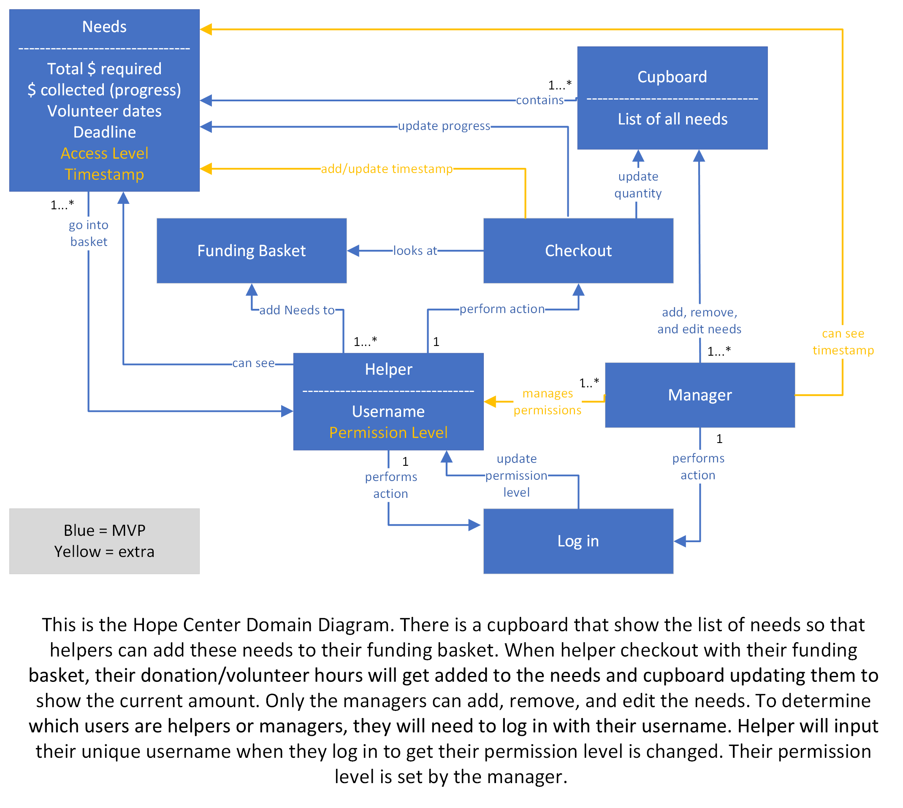
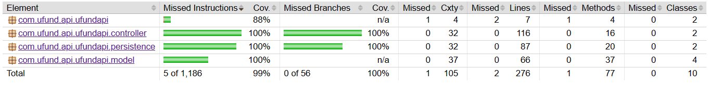

# PROJECT Design Documentation

> _The following template provides the headings for your Design
> Documentation.  As you edit each section make sure you remove these
> commentary 'blockquotes'; the lines that start with a > character
> and appear in the generated PDF in italics but do so only **after** all team members agree that the requirements for that section and current Sprint have been met. **Do not** delete future Sprint expectations._

## Team Information
* Team name: The Right Angle
* Team members
  * Logan Nickerson
  * Leah Delnesa 
  * May Jiang
  * Kieran Stewart
  * Douglas Tavolette

## Executive Summary

This is a summary of the project.

### Purpose
This is a website for the Hope Center that aims to help the church keep track of donation and volunteering hours. Admins on the site will be able to manage all the needs that church currently have avaliable that users can contribute to. Some needs will ask for monetary donation while other will ask for volunteer hours. The most important user group in this application is the potential volunteers, whose goals are to donate either their time or money through a simple and effective site. 

### Glossary and Acronyms
> _**[Sprint 4]** Provide a table of terms and acronyms._

| Term | Definition |
|------|------------|
| SPA | Single Page |

## Requirements

This section describes the features of the application.

> _In this section you do not need to be exhaustive and list every
> story.  Focus on top-level features from the Vision document and
> maybe Epics and critical Stories._
* Account management (create,delete,update,and login accounts)
* Need management (create,delete,and update needs)
* Funding Basket management (add,remove,and save needs within the funding basket)

### Definition of MVP

Admins and users will log into the website portal, where they will be directed to their personal dashboard. Admins on the site will be able to add/delete/update needs to the cupboard, and users will be able to send donation and/or sign up for vounteering hours for needs in their funding basket taken from the cupboard. Users will be able to add the needs to their basket by reviewing the list of avaliable needs the admins has created. Once the user is satisfied with their contribution, they can check out their funding basket which will update the information in the backend for the admin and future users to see. 

### MVP Features
  Authentication/Login in: 
1) Users have the ability to log in and out of application
2) U-fund Managaer logs in using reserved username of "admin" - any other username is assumed to be helpers/volunteers. 
3) Usernames also can't be duplicated

  Volunteer Functionality 
1) A Volunteer is able to see Cupboard containing list of needs
2) A Volunteer is able to Search through needs
3) A Volunteer is able to add and remove needs from their funding basket
4) A Volunteer is able to "checkout" (commit) to need(s) in their funding basket - Cupboard and corresponding needs are updated accordingly 

  U-fund Manager Functionality
1) U-fund Manager is able to add, remove, and edit need(s) within Cupboard
2) U-fund Manager is able to Search through needs
3) U-fund Manager does NOT have accoess to funding basket and in turn checkout, but is able to view transaction history of a need
4) U-fund Manager is able to create tags and delegate to specific needs and volunteers 

### Enhancements

The first enhancement incorporated is time stamps along with donor payments. When viewing a need, an admin user is able to look and see a table with the history of every transaction made on that need including the date and monetary amount donated. 

Our second enhancement is Authorized Volunteers. Admins have the ability to create tags. These tags are then delegated to needs and certain volunteers. Volunteers are then able to view needs that contain the corresponding tags they’ve been given by the admin. For example, say an admin creates a need called “School fund”, and say they only want certain volunteers to be able to see and donate to this need. They can create a tag called “School exclusive” and attach it to the “School fund” need. Then they can go the volunteer accounts and attach the tag to whatever volunteers they choose to. These volunteers are thus given exclusive access to said need.

## Application Domain

This section describes the application domain.

Entities + Relationships:

Manager- represents a U-Fund manager account
  Manager->Cupboard: able to add, remove, edit needs within Cupboard
  Manager->Helper: manage permissons/view of volunteers
  Manager->Needs: able to view monetary transaction history of each need

Helper- represents a Volunteer account
  Helper->Checkout: able to confirm and commit to need(s)
  Helper->Funding Basket: able to add need(s) they want to support to basket
  Helper->Needs: able to view needs of U-Fund 

Needs- represents a goal of the U-fund - from volunteer view simply contains monetary/volunteer goal, deadline. Manager contains same view in addition to transaction history
  Needs->Helper: 

Cupboard- contains list of needs

Funding Basket- represents container where needs volunteer choose to support are collected

Checkout- represents space where volunteers confirm to chosen needs 
  Checkout->Needs: updates progress on needs checked out by helper/volunteer
  Checkout->Cupboard: updates quantity of needs seen by helper depending on whether a donation has fully fulfilled a need 
  Checkout->Funding Basket: looks at Funding Basket for needs that need to be updated

## Architecture and Design

This section describes the application architecture.

### Summary

The following Tiers/Layers model shows a high-level view of the webapp's architecture. 

The web application, is built using the Model–View–ViewModel (MVVM) architecture pattern. 

The Model stores the application data objects including any functionality to provide persistance. 

The View is the client-side SPA built with Angular utilizing HTML, CSS and TypeScript. The ViewModel provides RESTful APIs to the client (View) as well as any logic required to manipulate the data objects from the Model.

Both the ViewModel and Model are built using Java and Spring Framework. Details of the components within these tiers are supplied below.

### Overview of User Interface

The user interface is built with Angular 15.

This section describes the web interface flow; this is how the user views and interacts with the web application.

> _Provide a summary of the application's user interface.  Describe, from the user's perspective, the flow of the pages in the web application._

### View Tier
> _**[Sprint 4]** Provide a summary of the View Tier UI of your architecture.
> Describe the types of components in the tier and describe their
> responsibilities.  This should be a narrative description, i.e. it has
> a flow or "story line" that the reader can follow._

> _**[Sprint 4]** You must  provide at least **2 sequence diagrams** as is relevant to a particular aspects 
> of the design that you are describing.  (**For example**, in a shopping experience application you might create a 
> sequence diagram of a customer searching for an item and adding to their cart.)
> As these can span multiple tiers, be sure to include an relevant HTTP requests from the client-side to the server-side 
> to help illustrate the end-to-end flow._

> _**[Sprint 4]** To adequately show your system, you will need to present the **class diagrams** where relevant in your design. Some additional tips:_
 >* _Class diagrams only apply to the **ViewModel** and **Model** Tier_
>* _A single class diagram of the entire system will not be effective. You may start with one, but will be need to break it down into smaller sections to account for requirements of each of the Tier static models below._
 >* _Correct labeling of relationships with proper notation for the relationship type, multiplicities, and navigation information will be important._
 >* _Include other details such as attributes and method signatures that you think are needed to support the level of detail in your discussion._

### ViewModel Tier
* CupboardController: This is the controller class that handles all the HTTP request that handles the Needs object. It's uses the REST API and Spring to handle all the HTTP requests.
* Need: This is an object that holds all the properties of a need. Those properties are: goal, progress, name, description, volunteer dates, deadline, type.
* Date: This is an object that hold the year, month, and date information. It is used by the Need class to define the date of which volunteers are needed.
* NeedType: This is an enum to help seperate the monetary needs from the volunteer needs.
* AccountController: This is the controller class that  handles all the HTTP request that handles the Account object. It's uses the REST API and Spring to handle all the HTTP requests.
* Account: This is an object that holds all the properties of an account. These properties are: name, password, email, isAdmin.

### Model Tier

* CupboardDAO: This is an interface that that defines methods needed to alter data in the cupboard.json. This is also our seam for unit testing.
* CupboardFileDAO: This is a class that implements CupboardDAO and defines all the methods. This is the class that actually make the changes to the cupboard.json.
* Cupboard.json: This is the database that hold all the Needs objects in the cupboard.
* AccountDAO: This is an interface that that defines methods needed to alter data in the account.json. This is also our seam for unit testing.
* AccountFileDAO: This is a class that implements AccountDAO and defines all the methods. This is the class that actually make the changes to the account.json.
* Account.json: This is the database that hold all the account objects.

## OO Design Principles

* Dependency injection: We are using Spring framework which creates a CupboardFileDAO object. The controller class receives an instance of the interface CupboardDAO that has methods needed to alter data in the cupboard.json. When we have to write data to the cupboard.json we used CupboardFileDAO which implements the methods from the interface CupboardDAO. CupboardController does not depend on the specific implementation, however, as long as it implements CupboardDAO. The CupboardDAO, as an interface, enforces CupboardFileDAO to contain the correct methods. If we need to change how data is written to cupboard.json (or if we get rid of cupboard.json altogether) we can do so without impacting the functionality of the CupboardController.
* Single Responsibility: For our UI, we use multiple angular services to help direct the flow of different data between the different components. For example, we have both a NeedService, BasketService, and LoginService. NeedService is specifically used to send the HTTP request to the CupboardController to manipulate data in the cupboard.json. The BasketService allows users to add, remove, update, and clear needs from their funding basket. When a user wants to checkout their funding basket, NeedService is called to send the HTTP request to the CupboardController to make changes to the cupboard.json while the BasketService is called to clear the funding basket. LoginService handles all the HTTP request to the AccountController to manipulate data in the account.json, and to also verify that usernames and passwords match each other when users login.  Need component (the way we show a need), for example, can use the Need service without caring about how Needs are retreived.  Need service, therefore, has that single responsibility.
* Pure Fabrication: For our application, the Need class was responsible for managing all aspects related to user needs, including details and editing functionalities. But as we starting implementing tools the managers would be using and the application grew more conplex, it became apparent that it was too much for a single class to hold responsibility of. This resulted in us creating the need-detail class and the need-edit. Now instead of offloading functionaility into the need class itself, need-detail and need-edit are able to bear a majority of the load in order to maintain Single Responsibility
*  Open/closed : In our application through the implementation of dependency injection, resulted by the Spring framework, we make sure our components is open for extension but closed for modification. For instance, the CupboardController class gets an instance of the CupboardDAO interface, abstracting away the specific implementation details necessary. By use of the CupboardFileDAO, which implements the CupboardDAO interface, we obtain functionality while maintaining loose coupling. This adherence to the open/closed principle makes us able to effortlessly switch implementations or modify data storage mechanisms, such as transitioning away from cupboard.json, without making alterations to the CupboardController

## Static Code Analysis/Future Design Improvements
* Area 1: logger string concatenation
We passed strings to the logger in Java with string concatenation, like "Name: " + name.  This apparently adds overhead to concatenate the string, which is uneccessary.  We should instead use the logger's built in formatting, similar to the printf() method. There are a lot of instances of this issue flagged in Sonar.  Our recommended fix is to go through each logging instance and use the built in formatting.  If that isn't possible in the future for some reason, consider using the lazy load, which takes the form of ()->expression.

* Area 2: less than elegant code
There were several areas of code that were flagged as "clumsy."  The screenshot below shows an instance where a boolean literal was used instead of the !.  Another similar issue is an if statement that was used when the boolean condition should have been returned.  if(expression) return true; return false; should be rewritten as return expression;.  Other errors were similar to this, and can all be categorized as awkward boolean handling.  The reason they are errors is because they create confusion and make code less readable.  Elegance improves comprehension and maintainability. Further examples of boolean fumbles take the following forms: !(a == b) --> a != b, method() == false --> !method(), and if(condition) return false; else return true; -->  return condition;.  Our recommended fix is to replace these instances with their alternatives as suggested by Sonar and elegant boolean logic.

* Area 3: style
There are a few instances of incorrect style, which negatively impacts readability.  It can also cause psychological damage to Java programmers.  One instance is the order of modifiers, which should be private static final, as seen in the image below.  This is a problem because it doesn't sound right, and maybe causes less readability.  Another style error is naming variables with a CapitalLetter at the start, but they should use camelCase.  This example causes confusion between the Need class and the need instance, which was called Need.  Capital camel case is reserved for classes in Java.  Our recommended fix is to replace these style errors with their respective solutions, and use caution with the ctrl+F feature of their favorite IDE.  New developers should make sure their IDE has a reasonably distinct color for variables and class names at least until all occurrences of this issue are resolved.

* Area 4: ArrayList implementation exposed
This screenshot shows that we returned an ArrayList in a getter.  Sonar says we should return just a List for better single responsibility.  We would take it a step further and say that this class should not return any kind of List.  An array would be better, and we acknowledge that the ArrayList solution is a last minute hack.  We did this because the json serialization was acting up.  We have since implemented a solution to the json problems, and we encourage new developers to allocate proper time and team attention to areas of code that use external imports such as Jackson.  The reason we should not return a specific implementation of List is because it exposes the inner workings of the class too much.  We also use more getters and setters than are strictly necessary.  Our backend does relatively little manipulation to the data; these excess methods are really just there because the Spring tutorial we followed had so many (which were there in turn to just take up space).  Getters and setters should exist as a way of manipulating their object in a way that makes intuitive sense to someone who knows nothing about the class' implementation, so having getters and setters for everything makes our classes harder to use.  This last intuition is not reported by Sonar because it has no way of detecting this.  Our recommended fix is to replace the ArrayList with an Array, at least superficially.  We also suggest trimming the getters and setters down to what is strictly necessary, and favor descriptive methods over manipulating method results.  New developers should not under any circumstances iterate over an array returned by a method, and should avoid returning anything that isn't suggested by the method's name.

> _**[Sprint 4]** With the results from the Static Code Analysis exercise, 
> **Identify 3-4** areas within your code that have been flagged by the Static Code 
> Analysis Tool (SonarQube) and provide your analysis and recommendations.  
> Include any relevant screenshot(s) with each area._

If we given more time to work on our application we think there are many changes that could made to the user interface regarding style and functionality when it comes to the look of the cupboard. At a certain point because of the way we presented our needs after adding a certain amount of needs they run off the page. If we had more time we could possibly create icons instead of tabs side to side, and resize the cupboard when too much space has been taken up. As for the matter of refactoring, we most likley would alter the current state of our UI applcation, because although it works seamlessly, a majority of it lies within a single class's (need-details) html. We should most likley choose home-view as the class to designate this responsibility to instead

## Testing
> _This section will provide information about the testing performed
> and the results of the testing._

### Acceptance Testing

All completed stories pass their acceptance testing accept for checking out in the case of a need with a volunteer, but some UI stories have other issues. A recent release has fixed outstanding log in issues, but a remaining quirk is that when logging in with a username that does not exist, a console error is generated.  This does not impact the functionality of log in.  Admin privileges are successfully loaded, but they do not impact the site yet. There are a couple more console errors, for example when admin goes onto a need that's goal is volunteer hours, transaction history returns back a 404.

### Unit Testing and Code Coverage
> _**[Sprint 4]** Discuss your unit testing strategy. Report on the code coverage
> achieved from unit testing of the code base. Discuss the team's
> coverage targets, why you selected those values, and how well your
> code coverage met your targets._

>_**[Sprint 4]** **Include images of your code coverage report.** If there are any anomalies, discuss
> those._

## Ongoing Rationale
>_**[Sprint 1, 2, 3 & 4]** Throughout the project, provide a time stamp **(yyyy/mm/dd): Sprint # and description** of any _**mayor**_ team decisions or design milestones/changes and corresponding justification._
